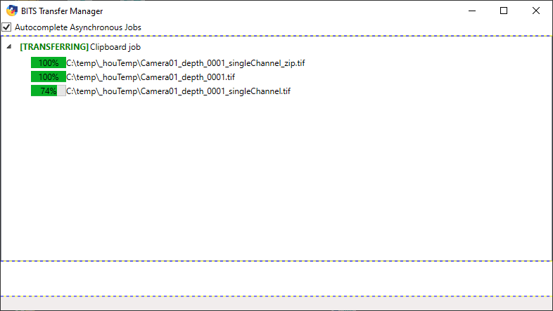
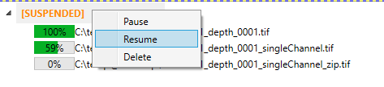
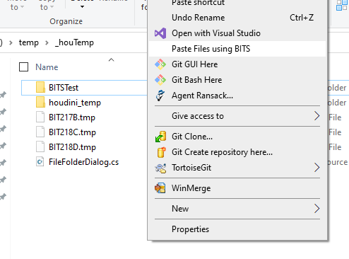
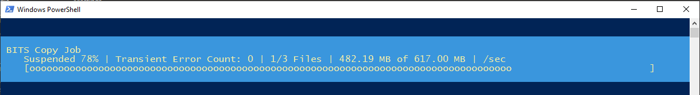

# BITS Transfer Manager

BITS Transfer Manager is a .Net App + supporting Powershell script to ease the use of BITS file transfers.  BITS is a powerfull tool that supports asynchronous file transfers and is very resilient to transient network errors.  It can even recover from a full restart of windows in the case of power outages etc.  However there's no easy way to create and create and manage BITS jobs, until now!
 
The main problem with using BITS asynchronous file transfers is they are not automically completed.  ie even if the files have finished copying they are not renamed to the correct file names until the BITS system is notified it should finish the job.
 
 ### Features
 - Autocomplete asynchronous BITS jobs
 - Pause, Resume and Delete jobs
 - Shell integration to create new jobs by "Pasting" files
 - Handles File paths that contain escape characters
 - Handles full recursive folder transfers

[BITS Information](https://en.wikipedia.org/wiki/Background_Intelligent_Transfer_Service)

## BITS Transfer Manager App
This app can be used to to view and manage all the current BITS jobs that exist on your local computer.  
### Usage
- Expand jobs to show the included files:

 

- Pause, Resume or Delete jobs by right-clicking on a job title:

 

- The app will stay open in the tray when closed to ensure asynchronous jobs are completed.  To close the app right-click on it's tray icon and select exit.
- Drag-and-drop files/folders onto the app window to create new jobs.

## BITS File Paste Script and Shell Integration
This is a Poweshell script that when called will look at the contents of the Windows clipboard looking for file drop objects.  If it finds them and along with a given distination path will create a new BITS job.  As long as the script is left open it will update the job progress and autocomplete.  If the script window is closed the job will continue to copy but will not auto complete unless the BITS Transfer Manager app is running.

### Usage
1. Use the usual Windows methods of Copying files to the clipboard as though you are going to use the normal built in Paste functionality.
2. Navigate to the destination folder, then right-clikc and select: "Paste files using BITS". This will execute the script, create a new BITS job, and show it's progress

3. Once the job is complete it will be automatically completed and the script window will close.

In the case of network errors etc BITS jobs created using this method have a time out of 1 day with a retry interval of 1 minute.  Incomplete BITS jobs are not transient and will survive a system restart.  For example if you're copying a couple of TBs off a network drive overnight and the system restarts mid-way through, the BITS job will still be there and can resume at any time using the BITS Transfer Manager app.

The script is called BITSPasteFiles.ps1 and is located in the BITS Transfer Manager apps install location.  You can use it in your own automations by copying files to the clipboard then calling the script supplying a destination path.

## Building
Use VS 2019+ to build the BITSTransferManager project.  To build the BITSTransferManagerSetup project you'll first need to install the "Installer Project" Visual Studio extension.

## Known Bugs and Issues
- When copying large file sizes (or the entire job size is large) the Paste script's job progress will error.  This does not affect the actual job, just the progress display.
